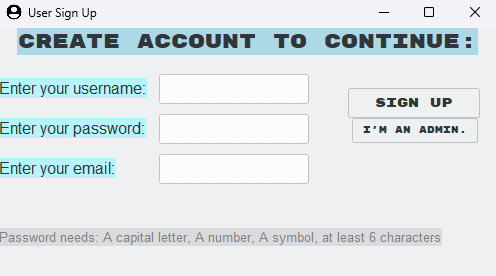

# 🔐 Login Form (Python)

A graphical **Login Form and User Sign-Up System** built with Python and Tkinter.  
This application allows users to create an account, validate credentials, and log in with secure password rules. It also includes a special **admin login** mode.

---

## ✨ Features

### User Account Creation
- Users can **sign up** with:
  - Username
  - Password
  - Email
- Password validation requires:
  - At least **6 characters**
  - **One uppercase letter**
  - **One number**
  - **One symbol** (e.g., !@#$%^&*()-_+=<>?/.,;)
- Email must contain `@`
- Visual feedback for invalid inputs (highlighted messages)

### Login System
- Separate login window after account creation
- User login checks credentials against stored information
- Admin login mode:
  - Predefined credentials:
    - Username: `AlexIsNotInset`
    - Password: `12345678`
    - Email: `inset@python.com`
- Displays success or failure messages with **color-coded feedback**
- Window titles update according to login success/failure

### Graphical User Interface (GUI)
- Built with **Tkinter** and **ttkthemes** (theme: "breeze")
- Organized layout with frames, labels, buttons, and entry fields
- Read-only entry fields for passwords (masked with •)
- Styled buttons and labels with custom fonts
- Admin login button for special access
- Background colors enhance clarity and readability

### Additional Features
- Tracks **login attempts** and displays feedback
- Automatically opens the login window after successful account creation
- Prevents account creation with duplicate admin credentials
- Modern theming with **ttkthemes** and window icon (`user.png`)

---

## 🛠 Technologies Used

- **Python 3** (required)
- **Tkinter** (built-in GUI)
- **ttkthemes** (UI theming)

---

## ▶️ How to Run

1. Make sure Python 3 is installed
2. Install the external dependency:
   ```bash
   pip install ttkthemes
   ```
3. Ensure `user.png` is in the same directory as the script
4. Run the program:
   ```bash
   python login_form.py
   ```

---

## 📂 Required Files

- `login_form.py`
- `user.png`

---

## ⚠️ Notes

- Password rules are **strict** to demonstrate validation logic
- Admin login is hardcoded for demonstration purposes
- Visual feedback highlights errors or successful actions
- Designed for **educational purposes** and learning Tkinter GUIs

---

## 👤 Author

**AlexIsNotInset**


